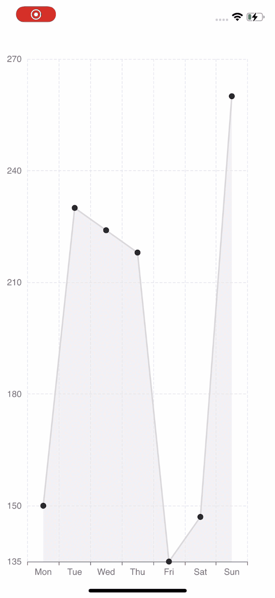

# Create a adaptive-sized chart

During the coding process, sometimes we don't want to directly define fixed-sized charts but rather let ECharts charts automatically adapt to the container size. Here, we'll provide a simple example to demonstrate how to finish this.

1. First, as in the previous example, import the chart dependencies. Here, we are using LineChart, so we only import it. In practice, you should import the chart based on your specific use case.

```tsx
import React, { useState, useRef, useEffect } from "react";
import { StyleSheet, View, Dimensions } from "react-native";
import * as echarts from "echarts/core";
import { LineChart } from "echarts/charts";
import { GridComponent } from "echarts/components";
import { SkiaRenderer, SkiaChart } from "@wuba/react-native-echarts";
```

2. Use echarts.use to register renderers and charts.

```tsx
echarts.use([SkiaRenderer, LineChart, GridComponent]);
```

3. Create a Ref for the SkiaChart component and use a View container to wrap it. Use onLayout to obtain the container's width and height for later assignment to the ECharts chart.

```tsx
export default function App() {
  const skiaRef = useRef<any>(null);
  const chartRef = useRef<any>(null);
  const [chartWidth, setChartWidth] = useState<number>(0);
  const [chartHeight, setChartHeight] = useState<number>(0);
}
```

4. Write the chart options.

```tsx
const option = {
  xAxis: {
    type: "category",
    data: ["Mon", "Tue", "Wed", "Thu", "Fri", "Sat", "Sun"],
    splitLine: {
      show: true,
      lineStyle: {
        type: "dashed",
      },
    },
  },
  yAxis: {
    type: "value",
    min: "dataMin",
    splitLine: {
      show: true,
      lineStyle: {
        type: "dashed",
      },
    },
  },
  series: [
    {
      data: [150, 230, 224, 218, 135, 147, 260],
      type: "line",
      areaStyle: {
        color: "rgba(230, 231, 231,0.8)",
      },
      lineStyle: {
        color: "#d6d6d7",
      },
      symbol: "circle",
      symbolSize: 8,
      itemStyle: {
        color: "#24262a",
      },
    },
  ],
};
```

5. Create a chart instance and set the options.

```tsx
let chart = echarts.init(skiaRef.current, "light", {
  renderer: "skia",
  width: chartWidth,
  height: chartHeight,
});
chart.setOption(option);
```

After following the above steps, we have an initial chart that matches the size of the parent container. If we also need the chart to adapt its size based on external conditions, there are a few more steps to take. Here, we will demonstrate how to make the chart responsive to changes in mobile screen dimensions as an example.

6. Register the 'Dimensions' change event to listen for changes in screen size.

```tsx
const handleDimensionsChange = (e) => {
  const { width, height } = e.screen;
};

useEffect(() => {
  Dimensions.addEventListener("change", handleDimensionsChange);
  return () => {
    Dimensions.removeEventListener("change", handleDimensionsChange);
  };
}, []);
```

7. Upon detecting a change in screen size, reset the chart's dimensions.

```tsx
const handleDimensionsChange = (e) => {
  const { width, height } = e.screen;
  setChartWidth(width);
  setChartHeight(height);
};
```

8. Redraw the chart.

```tsx
useEffect(() => {
  chartRef.current.resize({
    width: chartWidth,
    height: chartHeight,
  });
}, [chartWidth, chartHeight]);
```

The complete code is as follows:

```tsx
import React, { useState, useRef, useEffect } from "react";
import { StyleSheet, View, Dimensions } from "react-native";
import * as echarts from "echarts/core";
import { LineChart } from "echarts/charts";
import { GridComponent } from "echarts/components";
import { SkiaRenderer, SkiaChart } from "@wuba/react-native-echarts";

echarts.use([SkiaRenderer, LineChart, GridComponent]);

export default function App() {
  const skiaRef = useRef<any>(null);
  const chartRef = useRef<any>(null);
  const [chartWidth, setChartWidth] = useState<number>(0);
  const [chartHeight, setChartHeight] = useState<number>(0);

  useEffect(() => {
    Dimensions.addEventListener("change", handleDimensionsChange);
    return () => {
      Dimensions.removeEventListener("change", handleDimensionsChange);
    };
  }, []);

  useEffect(() => {
    const option = {
      xAxis: {
        type: "category",
        data: ["Mon", "Tue", "Wed", "Thu", "Fri", "Sat", "Sun"],
        splitLine: {
          show: true,
          lineStyle: {
            type: "dashed",
          },
        },
      },
      yAxis: {
        type: "value",
        min: "dataMin",
        splitLine: {
          show: true,
          lineStyle: {
            type: "dashed",
          },
        },
      },
      series: [
        {
          data: [150, 230, 224, 218, 135, 147, 260],
          type: "line",
          areaStyle: {
            color: "rgba(230, 231, 231,0.8)",
          },
          lineStyle: {
            color: "#d6d6d7",
          },
          symbol: "circle",
          symbolSize: 8,
          itemStyle: {
            color: "#24262a",
          },
        },
      ],
    };
    let chart: any;
    if (skiaRef.current) {
      chart = echarts.init(skiaRef.current, "light", {
        renderer: "skia",
        width: chartWidth,
        height: chartHeight,
      });
      chart.setOption(option);
      chartRef.current = chart;
    }
    return () => chart?.dispose();
  }, []);


  // watching for size changes, redraw the chart.
  useEffect(() => {
    chartRef.current.resize({
      width: chartWidth,
      height: chartHeight,
    });
  }, [chartWidth, chartHeight]);

  // Get the width and height of the container
  const handleLayout = (e) => {
    const { width, height } = e.nativeEvent.layout;
    setChartWidth(width);
    setChartHeight(height);
  };

  // Screen orientation change event
  const handleDimensionsChange = (e) => {
    const { width, height } = e.screen;
    setChartWidth(width);
    setChartHeight(height);
  };

  // The parent container box must have width and height in order to inherit
  return (
    <View style={styles.container} onLayout={handleLayout}>
      <SkiaChart ref={skiaRef} />
    </View>
  );
}

const styles = StyleSheet.create({
    container: {
        flex: 1,
        alignItems: 'center',
        justifyContent: 'center',
    },
}
```

You should see the following screen:

| iOS                      | Android                          |
| ------------------------ | -------------------------------- |
|  |  |

If you want to use the react-native-svg，just replace the SkiaChart with SvgChart and use 'svg' as renderer.

For more chart configuration, please refer to [echarts documentation](https://echarts.apache.org/en/option.html#title).
