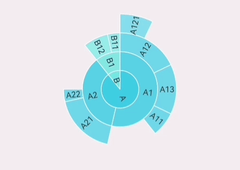
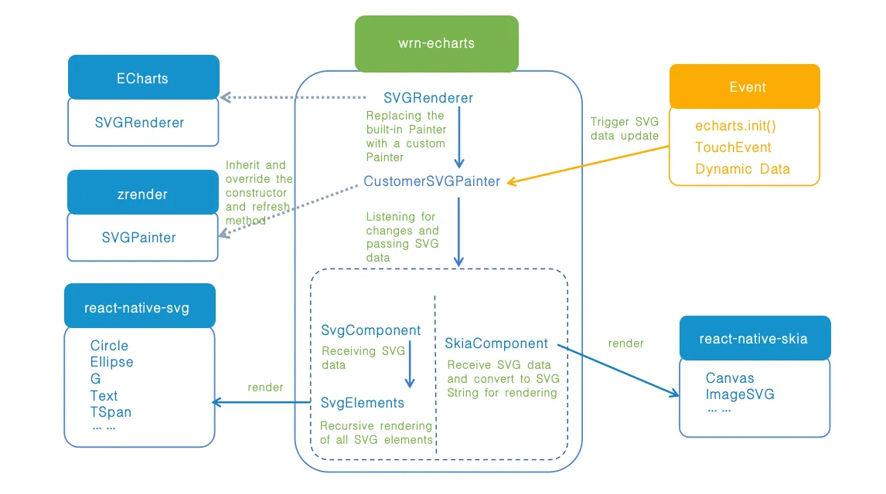

私たちは、React Nativeアプリケーション向けのオープンソースのグラフィックスライブラリを開発しました。このライブラリは、[Apache ECharts](https://github.com/apache/echarts)をベースにしており、[RNSVG](https://github.com/react-native-svg/react-native-svg)または[RNSkia](https://github.com/shopify/react-native-skia)を使用してほぼウェブ上で使用するのとほぼ同じ方法でレンダリングします。ほとんどのグラフィックスのシナリオに対応しています。プロジェクトのソースコードは、https://github.com/wuba/react-native-echarts で入手できます。


<!--truncate-->
## はじめに

チャートを描画する際に、私たちが最も頻繁に使用するチャートライブラリはEChartsです。市場で最も成熟したチャートライブラリの1つであり、主にウェブサイドで使用されていますが、React Nativeでの使用方法は一番良い方法はありません。このような状況に直面した場合、私たちの解決策は次のとおりです：

オプション1：React Native専用のチャートライブラリを代替として使用する。例えば、[react-native-charts-wrapper](https://github.com/wuxudong/react-native-charts-wrapper)や[victory-native](https://github.com/FormidableLabs/victory/tree/main/packages/victory-native)などがあります。これらのチャートライブラリのスタイルやインタラクションはEChartsとは異なり、チャートの豊富さも十分ではありません。特にマルチプラットフォームの要件の場合、React Native用に独立したUIインタラクションデザインが必要です。

オプション2：[react-native-webview](https://github.com/react-native-webview/react-native-webview)を使用してチャートをレンダリングする。このソリューションでは、初期化にはinjectedJavaScriptを使用し、イベント応答にはpostMessageを使用します。[react-native-echarts-pro](https://github.com/supervons/react-native-echarts-pro)や[native-echarts](https://github.com/somonus/react-native-echarts)などのオープンソースライブラリを直接使用することができます。ページ上に複数のチャートやチャート要素がある場合、大量のデータを持つエリアチャートや単軸散布図のAndroidでの白い画面現象など、パフォーマンスのボトルネックに遭遇することがあります。また、レンダリング中に明らかな遅延やフレームのドロップが発生することもあります。

そのため、私たちはEChartsの機能をReact Nativeアプリケーションに統合できる新しいチャートライブラリを開発することを検討しています。ゼロからグラフィックスライブラリを作成したくないので、現在React Native向けに設計されたグラフィックスライブラリを見てみましょう：

1. react-native-svg：iOS、Android、macOS、WindowsなどのReact NativeにSVGサポートを提供します。また、ウェブの互換性レイヤーも提供します。
2. react-native-skia：React Native SkiaはSkia Graphics LibraryをReact Nativeにもたらします。SkiaはGoogle ChromeとChrome OS、Android、Flutter、Mozilla FirefoxとFirefox OSなど、多くの製品のグラフィックスエンジンとして機能しています。また、SVG形式の画像のレンダリングをサポートする[ImageSVG](https://shopify.github.io/react-native-skia/docs/images-svg)コンポーネントも提供しています。

EChartsはSVGレンダリングをサポートしているため、チャートがレンダリングされる前にSVGデータを取得し、react-native-svgまたはreact-native-skiaに提供すれば、目標を達成することができます。

一定期間の実験の結果、[@wuba/react-native-echart](https://github.com/wuba/react-native-echarts)を開発しました。以下の機能があります：

- 🔥 Apache EChartsと同じ方法
- 🎨 豊富なチャートで、ほぼすべての使用シナリオをカバー
- ✨ オプションのレンダリングライブラリ、SkiaまたはSVG
- 🚀 ウェブとのコードの再利用が可能
- 📱 ズームジェスチャーのサポート

## 使用方法

実際には、@wuba/react-native-echartsの全体的なプロセスはEChartsと似ています：

1. yarn add @wuba/react-native-echarts
2. react-native-svgまたは@shopify/react-native-skiaをインストールするかどうかを選択します
3. @wuba/react-native-echartsから関連するコンポーネントをインポートします
4. EChartsのSVGRendererを@wuba/react-native-echartsのSVGRendererで置き換えます
5. チャートのオプション設定情報を書きます
6. SkiaChart / SvgChartコンポーネントを使用します

以下はサンプルコードです：

```ts
// import { SkiaChart, SVGRenderer } from '@wuba/react-native-echarts';
import SkiaChart, { SVGRenderer } from '@wuba/react-native-echarts/skiaChart';
import * as echarts from 'echarts/core';
import { useRef, useEffect } from 'react';
import { LineChart } from 'echarts/charts';

echarts.use([ SVGRenderer, LineChart ])

export default function App() {
  const skiaRef = useRef<any>(null);
  useEffect(() => {
    const option = {
      xAxis: {
        type: 'category',
        data: ['Mon', 'Tue', 'Wed', 'Thu', 'Fri', 'Sat', 'Sun']
      },
      yAxis: {
        type: 'value'
      },
      series: [
        {
          data: [150, 230, 224, 218, 135, 147, 260],
          type: 'line'
        }
      ]
    }
    let chart: any;
    if (skiaRef.current) {
      chart = echarts.init(skiaRef.current, 'light', {
        renderer: 'svg',
        width: 250,
        height: 300,
      });
      chart.setOption(option);
    }
    return () => chart?.dispose();
  }, []);

  return <SkiaChart ref={skiaRef} />;
}
```

以下はスクリーンショットです：


簡単ですね。より多くのチャートの設定は、[echartsのウェブサイト](https://echarts.apache.org/examples/en/index.html)で確認できます。

私たちはEChartsが現在サポートしているほとんどのチャートをサポートしています。以下にいくつかのチャートの例を示しますが、[taro-playground](https://github.com/wuba/taro-playground)プロジェクトでさらに多くの例を見ることができます。




## パフォーマンス

前述のように、React NativeでEChartsを使用する主流のソリューションはWebViewを介して実装することです。多くのWebViewベースの実装の中で、react-native-echarts-proのユーザーが多いため、比較のためにreact-native-echarts-proを選びました。

以下は、異なる実装の初期化プロセスのスクリーンショットです：


多くのテストケースの結果、@wuba/react-native-echartsは通常の使用シナリオでパフォーマンスの利点がありますが、大量のデータがあるシナリオでは、宣言的なUIレンダリング方法のためにかなりの遅延が発生します。今後もパフォーマンスを改善するために探求を続けます。

## 実装の詳細



上記はライブラリのフローチャートです。ここでは、react-native-svgを例にとって、コアのワークフローは次のようになります：

1. EChartsのSVGRendererを置き換え、登録されたSVGPainterをカスタムのSVGPainterで置き換えます。
2. CustomSVGPainterはSVGPainterを継承し、コンストラクタと一部のrefresh関数を上書きし、チャートデータが初期化または更新されると、SVGComponentに登録されたパッチ関数を呼び出して計算された新しいSVGデータを渡します。
3. SVGComponentを定義し、現在のチャートインスタンスを管理し、リアルタイムのSVGデータを受け取り、それをreact-native-svgが提供する最終的なレンダリングアクションのためのSVG要素関数を呼び出します。
4. react-native-skiaを使用する場合は、いくつかの違いがあります。定義されたSkiaComponentコンポーネントには、patchStringというコアメソッドがあります。patchStringは変更されたSVGデータを受け取り、それをSVG文字列に変換し、react-native-skiaのImageSVGコンポーネントに渡してレンダリングします。

## タッチイベントの処理

EChartsのイベントはマウスイベントです。クリック、ダブルクリック、マウスダウン、マウスムーブなどのイベントは、チャート要素の表示やアニメーションをトリガーするために使用されます。

React NativeのPanResponderを使用してイベントをキャプチャし、モバイルのTouchEventをマウスイベントとしてシミュレートし、EChartsのinitメソッドで生成されたチャートインスタンスにディスパッチします。

例えば、チャート上でマウスに追従して凡例を表示するアクションは、モバイル側ではTouchStart + TouchMoveであり、マウスイベントではmousedown + mousemoveに変換されます。

もう1つの例は、チャートのズームです。モバイル側では2本の指でのズームですが、マウスのマウスホイールイベントに変換され、2本の指の距離の変化によって対応するマウスホイールのスクロール距離が計算されます。

以下は主要なコードです：

1. TouchEventをMouseEventに変換する

```ts
PanResponder.create({
  onPanResponderGrant: ({ nativeEvent }) => {
    // アクションの開始、マウスダウンとムーブイベントに変換
    dispatchEvent(
      zrenderId,
      ['mousedown', 'mousemove'],
      nativeEvent,
      'start'
    );
  },
  onPanResponderMove: ({ nativeEvent }) => {
    // 指の移動操作の処理
    const length = nativeEvent.touches.length;
    if (length === 1) {
      // 1本の指
    } else if (length === 2) {
      // ここで2本の指の移動操作を処理します
      if (!zooming) {
        // ...
      } else {
        // ここでイベントをスクロールホイールに変換します
        const { initialX, initialY, prevDistance } = pan.current;
        const delta = distance - prevDistance;
        pan.current.prevDistance = distance;
        dispatchEvent(zrenderId, ['mousewheel'], nativeEvent, undefined, {
          zrX: initialX,
          zrY: initialY,
          zrDelta: delta / 120,
        });
      }
    }
  },
  onPanResponderRelease: ({ nativeEvent }) => {
    // アクションが終了し、マウスクリックリリース操作に変換されます
  },
})
```

2. MouseEventをEChartsのチャートインスタンスに適用する

```ts
function dispatchEvent(
  zrenderId: number,
  types: HandlerName[],
  nativeEvent: NativeTouchEvent,
  stage: 'start' | 'end' | 'change' | undefined,
  props: any = {
    zrX: nativeEvent.locationX,
    zrY: nativeEvent.locationY,
  }
) {
  if (zrenderId) {
    var handler = getInstance(zrenderId).handler;
    types.forEach(function (type) {
      handler.dispatch(type, {
        preventDefault: noop,
        stopImmediatePropagation: noop,
        stopPropagation: noop,
        ...props,
      });
      stage && handler.processGesture(wrapTouch(nativeEvent), stage);
    });
  }
}
```

## さらなる情報

https://github.com/wuba/react-native-echarts にアクセスしてソースコードを表示し、気に入ったらスターを付けてください。問題が発生した場合は、[issue](https://github.com/wuba/react-native-echarts/issues)を提出してください。

この記事のサンプルコードは、https://github.com/wuba/taro-playgroundプロジェクトにあります。こちらもオープンソースですので、興味のある方はアプリストアから最新バージョンのTaro Playgroundアプリを直接インストールするか、[リリースページ](https://github.com/wuba/taro-playground/releases)からインストールして体験してみてください。
