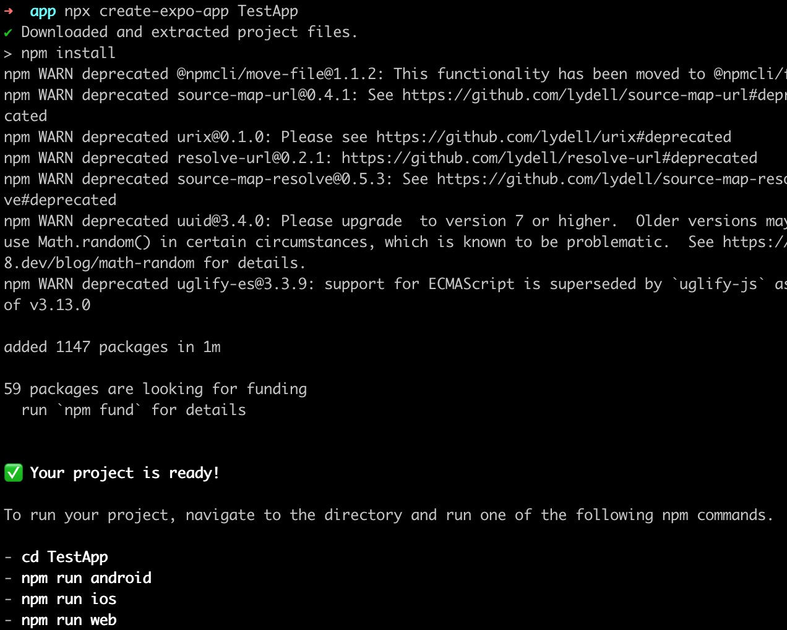
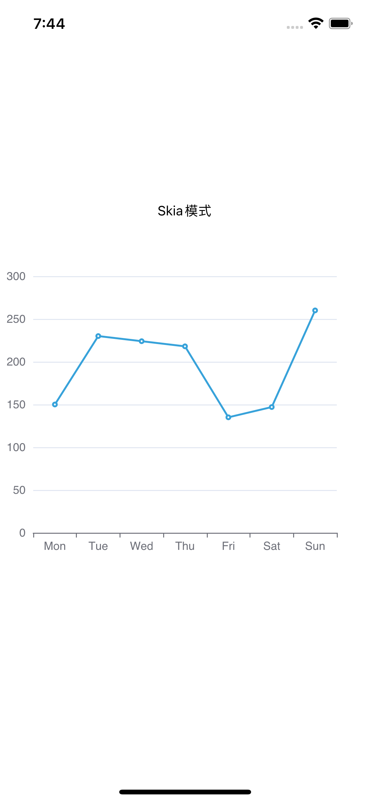

チャート関連の要件を書くために最も使用されるチャートライブラリは**echarts**です。ウェブサイト上でのechartsのパフォーマンスは非常に成熟しており、アプレット側には公式のソリューションが提供されていますが、RNでは対応がありません。市場では、検索のほとんどがまだWebビューの実装の本質に基づいていますが、私はRNベースのプログラムを好みます。なぜなら、ネイティブのエクスペリエンスの方がWebよりも優れているからです。

後で[**@wuba/react-native-echarts**](https://wuba.github.io/react-native-echarts/)を見つけてニーズを満たすために試してみましたが、結果は素晴らしかったです。実装の原理に興味がある方は[こちら](https://wuba.github.io/react-native-echarts/js/blog/using-apache-echarts-in-react-native)をクリックしてください。


<!--truncate-->

### ヒント

- すでにアプリパッケージを持っている場合は、以前のパッケージングプロセスを無視して、直接ステップ4から始めることができます。
- 試用のための完全なコードはGitHubで入手できます：[https://github.com/iambool/TestApp](https://github.com/iambool/TestApp)

## 使用手順

### ステップ1. 開発環境のセットアップ

ローカルのRN開発環境の構築手順はインターネットで入手できるため、ここでは再度説明しません。Googleで検索してください :)

### ステップ2. RNプロジェクトの作成

試用だったので、expoを使用してTestAppという新しいrnプロジェクトを初期化しました。

```
npx create-expo-app TestApp
```



### ステップ3. モバイルデバイス上でアプリをビルドする

コマンドラインでiOSとAndroidのアプリパッケージを生成します。iOSではエミュレータを使用することをお勧めします（証明書を一致させる必要はありません）、一方Androidでは実機に接続しました。

```
yarn android
yarn ios
```

パッケージを生成した後、以下のようなアプリが既に電話にインストールされていることを意味します。


### ステップ4. 関連する依存関係のインストール

```
yarn add @wuba/react-native-echarts echarts
yarn add @shopify/react-native-skia
yarn add react-native-svg
```

> 注意: 既存のプロジェクトにインストールする場合は、インストールが完了した後に新しいパッケージをビルドする必要があります。そうしないと、ネイティブの依存関係が不足してエラーが報告されます。

### ステップ5. Skiaモデルを試す

@wuba/react-native-echartsは2つの**レンダリングモード（SkiaとSvg）**をサポートしています。まずはSkiaを使用してシンプルなチャートを試してみましょう。以下の小さなステップに分かれています：

- echarts、チャートコンポーネントなどの依存関係をインポートします。
- チャートコンポーネントを登録します。
- チャートインスタンスを作成し、オプションを設定します。
- ページが破棄されたときにチャートインスタンスを同期的に破棄します。

具体的なコードは以下の通りです：

```javascript
import { useRef, useEffect } from 'react';
import { View } from 'react-native';
/**
 * 1. echartsの依存関係をインポートします。この例ではまず折れ線グラフを試します。
 */
import * as echarts from 'echarts/core';
import { LineChart } from 'echarts/charts';
import { GridComponent } from 'echarts/components';
import SkiaChart, { SVGRenderer } from '@wuba/react-native-echarts/skiaChart';

/**
 * 2. 必要なコンポーネントを登録します。
 * SVGRenderer: 登録が必要です
 * LineChart: 折れ線グラフを表示したいので、LineChartをインポートする必要があります
 *      - どのコンポーネントをインポートするかわからない場合は、エラーレポートを見て、エラーが欠落していると言われたものを追加します
 * GridComponent: エラーレポートが報告されたときのプロンプトで、それを追加しました、はは
 */
echarts.use([SVGRenderer, LineChart, GridComponent]);

export default () => {
  const skiaRef = useRef(null); // チャートインスタンスを保存するためのRef
  useEffect(() => {
    /**
     * 3. チャートオプション
     */
    const option = {
      xAxis: {
        type: 'category',
        data: ['Mon', 'Tue', 'Wed', 'Thu', 'Fri', 'Sat', 'Sun'],
      },
      yAxis: {
        type: 'value',
      },
      series: [
        {
          data: [150, 230, 224, 218, 135, 147, 260],
          type: 'line',
        },
      ],
    };
    let chart;
    if (skiaRef.current) {
      /**
       * 4. チャートを初期化します。下部の幅と高さを指定します。
       */
      chart = echarts.init(skiaRef.current, 'light', {
        renderer: 'svg',
        width: 400,
        height: 400,
      });
      chart.setOption(option);
    }
    /**
     * 5. ページが閉じられた後にチャートインスタンスを破棄します。
     */
    return () => chart?.dispose();
  }, []);
  return (
    <View className='index'>
      <SkiaChart ref={skiaRef} />
    </View>
  );
};
```

コードを書いた後、電話を振ってバンドルパッケージをリロードすると、次のエラーが報告されます：

> ERROR Invariant Violation: requireNativeComponent: "SkiaDomView" was not found in the UIManager.

それを調べたところ、[バージョンのダウングレード](https://stackoverflow.com/questions/74648194/shopify-react-native-skia-with-expo)が必要であると言われました。expoのバージョンに対応する必要があり、依存関係のインストール時に似たようなプロンプトが表示されるので、プロンプトされたバージョンをインストールすれば問題ありません。


したがって、指示に従ってバージョンをダウングレードしました：

```
@shopify/react-native-skia@0.1.157
react-native-svg@13.4.0
```

アプリを再ビルドした後、正常にロードされました（ただし、Androidはポイントをカバーしているようですが、画面幅は適応する必要があるようです）。

| iOS                    | Android                        |
| ---------------------- | ------------------------------ |
|  |  |

### ステップ6. Svgモデルを試す

Svgモードでより複雑な動的ソートバーチャートを作成し、SvgとSkiaを比較してみましょう。完全なコードは[こちら](https://github.com/iambool/TestApp/blob/main/pages/barRace/index.js)を参照してください。

```javascript
import SvgChart, { SVGRenderer } from '@wuba/react-native-echarts/svgChart';
// ...Some unimportant code is omitted here

// 必要なコンポーネントを登録します。例えば、BarChartとLegendComponentを登録します
echarts.use([SVGRenderer, BarChart, LegendComponent, GridComponent]);

export default () => {
  const skiaRef = useRef(null);
  const svgRef = useRef(null);

  useEffect(() => {
    // Skiaモード
    const skiaChartData = getData(); // チャートバーデータを生成する
    let skiaChart;
    let skiaInter;
    if (skiaRef.current) {
      skiaChart = echarts.init(skiaRef.current, 'light', {
        renderer: 'svg',
        width: 300,
        height: 300,
      });
      skiaChart.setOption(getDefaultOption(skiaChartData));
      setTimeout(function () {
        run(skiaChart, skiaChartData);
      }, 0);
      skiaInter = setInterval(function () {
        run(skiaChart, skiaChartData);
      }, 3000);
    }

    // Svgモード
    const svgChartData = getData();
    let svgChart;
    let svgInter;
    if (svgRef.current) {
      svgChart = echarts.init(svgRef.current, 'light', {
        renderer: 'svg',
        width: 300,
        height: 300,
      });
      svgChart.setOption(getDefaultOption(svgChartData));
      setTimeout(function () {
        run(svgChart, svgChartData);
      }, 0);
      svgInter = setInterval(function () {
        run(svgChart, svgChartData);
      }, 3000);
    }

    return () => {
      skiaChart?.dispose();
      svgChart?.dispose();
      // タイマーをクリーンアップする必要があるため、ページを終了した後も実行され続けることはありません
      clearInterval(skiaInter);
      clearInterval(svgInter);
    };
  }, []);
  return (
    <View>
      <Text>skia</Text>
      <SkiaChart ref={skiaRef} />
      <Text>svg</Text>
      <SvgChart ref={svgRef} />
    </View>
  );
};
```

目で見てもこれら2つのモードの違いはわかりません。

| iOS                                | Android                                |
| ---------------------------------- | -------------------------------------- |
|  |  |

### ステップ7. チャートコンポーネントをラップする

これまでのところ、効果はかなり良かったですが、毎回たくさんのものをインポートするのは面倒です。簡単にラップしてみましょう：

```javascript
import { useRef, useEffect } from 'react';
import * as echarts from 'echarts/core';
import { BarChart, LineChart, PieChart } from 'echarts/charts';
import {
  DataZoomComponent,
  GridComponent,
  LegendComponent,
  TitleComponent,
  ToolboxComponent,
  TooltipComponent,
} from 'echarts/components';
import {
  SVGRenderer,
  SvgChart as _SvgChart,
  SkiaChart as _SkiaChart,
} from '@wuba/react-native-echarts';
// 注意: svgまたはskiaのどちらか一方のみがインストールされている場合、次のように個別にインポートする必要があります。
// import _SkiaChart, { SVGRenderer } from '@wuba/react-native-echarts/skiaChart';
// import _SvgChart, { SVGRenderer } from '@wuba/react-native-echarts/svgChart';

import { Dimensions } from 'react-native';

// 必要なコンポーネントを登録します
echarts.use([
  DataZoomComponent,
  SVGRenderer,
  BarChart,
  GridComponent,
  LegendComponent,
  ToolboxComponent,
  TooltipComponent,
  TitleComponent,
  PieChart,
  LineChart,
]);

// チャートのデフォルトの幅と高さ
const CHART_WIDTH = Dimensions.get('screen').width; // デフォルトは電話の画面幅です
const CHART_HEIGHT = 300;

const Chart = ({
  option,
  onInit,
  width = CHART_WIDTH,
  height = CHART_HEIGHT,
  ChartComponent,
}) => {
  const chartRef = useRef(null);

  useEffect(() => {
    let chart;
    if (chartRef.current) {
      chart = echarts.init(chartRef.current, 'light', {
        renderer: 'svg',
        width,
        height,
      });
      option && chart.setOption(option);
      onInit?.(chart);
    }
    return () => chart?.dispose();
  }, [option]);
  return <ChartComponent ref={chartRef} />;
};

const SkiaChart = (props) => <Chart {...props} ChartComponent={_SkiaChart} />;
const SvgChart = (props) => <Chart {...props} ChartComponent={_SvgChart} />;
// これら2つのコンポーネントのみをエクスポートします
export { SkiaChart, SvgChart };
```

### ステップ8. 複数のチャートを使用する

ラップした後、複数のチャートを含むページを作成し、それがどのように機能するかを見てみましょう。ここでは「電子商取引データ分析」というページを作成し、折れ線グラフ、棒グラフ、円グラフを含んでいます。以下はsvgモードで書かれたメインのコードです。詳細なコードは[こちら](https://github.com/iambool/TestApp/tree/main/pages/ECdata)を参照してください。

```javascript
import { SkiaChart } from '../../components/Chart';
import { ScrollView, Text, View } from 'react-native';
import { StatusBar } from 'expo-status-bar';
import { useCallback, useEffect, useState } from 'react';
import {
  defaultActual,
  lineOption,
  salesStatus,
  salesVolume,
  userAnaly,
  getLineData,
} from './contants';
import styles from './styles';
// チャートのローディングを表示する
const showChartLoading = (chart) =>
  chart.showLoading('default', {
    maskColor: '#305d9e',
  });
// チャートのローディングを非表示にする
const hideChartLoading = (chart) => chart.hideLoading();

export default () => {
  const [actual, setActual] = useState(defaultActual); // リアルタイムデータを記録する

  useEffect(() => {
    // データの定期的なリクエストを想定しています
    const interv = setInterval(() => {
      const newActual = [];
      for (let it of actual) {
        newActual.push({
          ...it,
          num: it.num + Math.floor((Math.random() * it.num) / 100),
        });
      }
      setActual(newActual);
    }, 200);
    return () => clearInterval(interv);
  }, [actual]);

  const onInitLineChart = useCallback((myChart) => {
    showChartLoading(myChart);
    // データリクエストのシミュレーション
    setTimeout(() => {
      myChart.setOption({
        series: getLineData,
      });
      hideChartLoading(myChart);
    }, 1000);
  }, []);

  const onInitUserChart = useCallback((myChart) => {
    // データリクエストのシミュレーション、onInitLineChartと同様
  }, []);
  const onInitSaleChart = useCallback((myChart) => {
    // データリクエストのシミュレーション、onInitLineChartと同様
  }, []);
  const onInitStatusChart = useCallback((myChart) => {
    // Simulate data request, similar to onInitLineChart
  }, []);

  const chartList = [
    ['订单走势', lineOption, onInitLineChart],
    ['用户统计', userAnaly, onInitUserChart],
    ['各品类销售统计', salesVolume, onInitSaleChart],
    ['订单状态统计', salesStatus, onInitStatusChart],
  ];

  return (
    <ScrollView style={styles.index}>
      <StatusBar style='light' />
      <View>
        <View style={styles.index_panel_header}>
          <Text style={styles.index_panel_title}>实时数据</Text>
        </View>
        <View style={styles.index_panel_content}>
          {actual.map(({ title, num, unit }) => (
            <View key={title} style={styles.sale_item}>
              <View style={styles.sale_item_cell}>
                <Text style={styles.sale_item_text}>{title}</Text>
              </View>
              <View style={[styles.sale_item_cell, styles.num]}>
                <Text style={styles.sale_item_num}>{num}</Text>
              </View>
              <View style={[styles.sale_item_cell, styles.unit]}>
                <Text style={styles.sale_item_text}>{unit}</Text>
              </View>
            </View>
          ))}
        </View>
      </View>
      {chartList.map(([title, data, callback]) => (
        <View key={title}>
          <View style={styles.index_panel_header}>
            <Text style={styles.index_panel_title}>{title}</Text>
          </View>
          <View style={styles.index_panel_content}>
            <SkiaChart option={data} onInit={callback} />
          </View>
        </View>
      ))}
    </ScrollView>
  );
};
```

バンドルをリロードして結果を確認してください

| iOS                          | Android                          |
| ---------------------------- | -------------------------------- |
|  |  |

レンダリング後、iOS上のインタラクションは非常にスムーズですが、Android上のインタラクションは時折遅れるように感じます（私の電話が悪いわけではありませんよね？...）

もう一度Skiaモードを試してみてください


まあ、できるけど、中国語が正しく表示されないようです。Androidでは中国語が表示されず、iOSではコードの乱れがあります。ドキュメントを読んだ結果、Skiaは現在Android側で中国語をサポートしていないようです。iOSではフォントを「PingFang SC」に設定することで中国語を表示することができます。例えば：

```javascript
const option = {
  title: {
    text: '我是中文',
    textStyle: {
      fontFamily: 'PingFang SC', // フォントタイプを設定する
    },
  },
};
```

しかし、中国語を表示する場所ごとにフォントを設定する必要があります...それか最初にSvgを使用するか、私は怠惰です。

## 要約

使用してみた結果、以下のことをまとめました：

- サポートに関して、@wuba/react-native-echartsはGLシリーズやマップチャートを除くすべての種類のチャートをサポートしており、日常のビジネスには十分です。echartsでさまざまなチャートを実装するためのコードは[taro-playground](https://github.com/wuba/taro-playground)で見つけることができます。
- インタラクションに関して、iOSは非常に滑らかですが、Androidではフレームのドロップが時々発生することがあります。
- パフォーマンス：公式には他のソリューションよりも優れたパフォーマンスと報告されています。
  - 私は試しましたが、非常に大量のデータでは問題はありませんが、データ量が大きい場合（大量のデータヒートマップを描画するなど）、レンダリング速度が著しく低下します。これは公式の最適化待ちのポイントです。
  - また、ページに多くのチャートがある場合、実機でデバッグすると読み込み速度が遅くなるため、まずシミュレータを使用することをお勧めします。
- 中国語のサポート：Svgモードでは中国語がサポートされていますが、Skiaモードではまだ利用できません。

上記は個人的な意見ですので、ご質問があればお気軽にお聞きください。

