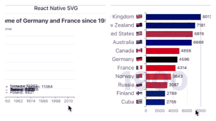
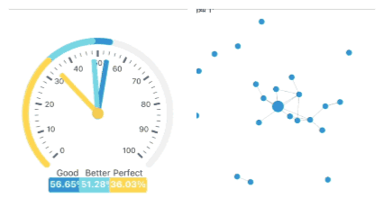
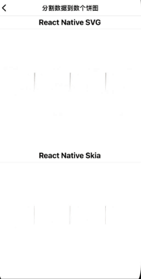
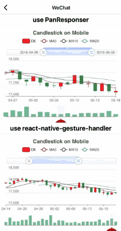

React Native ECharts 1.1 の安定版をリリースすることをお知らせします。新しいバージョンでは、[react-native-gesture-handler](https://github.com/software-mansion/react-native-gesture-handler) のジェスチャーソリューションなど、さまざまな改善が追加されています。詳細は以下をご覧ください。

[@wuba/react-native-echarts](https://github.com/wuba/react-native-echarts/) は、Apache ECharts をベースにした React Native 向けの素晴らしいチャートライブラリであり、[react-native-svg](https://github.com/software-mansion/react-native-svg) と [react-native-skia](https://github.com/shopify/react-native-skia) を活用しています。WebView ベースのソリューションと比較して、大幅にパフォーマンスが向上しています。プロジェクトの設計原則について詳しく知りたい場合は、[こちらをクリックして](https://wuba.github.io/react-native-echarts/blog/using-wuba-react-native-echarts) ご覧ください。

プロジェクトのソースコードは、https://github.com/wuba/react-native-echarts で入手できます。

## 機能

### サポートされる豊富なチャートタイプ

[@wuba/react-native-echart](https://github.com/wuba/react-native-echarts) は、ECharts チャートライブラリを React Native アプリケーションに統合するソリューションです。React Native のネイティブコンポーネントのレンダリング機能を活用することで、レンダリング速度が大幅に向上します。折れ線グラフ、面グラフ、棒グラフ、散布図など、一般的に使用されるさまざまなチャートタイプをサポートしており、キャンドルスティックチャートやヒートマップなどのより複雑なチャートも扱うことができます。さまざまなシナリオでさまざまな可視化要件を満たすことができます。

以下に一部の一般的なチャートタイプの例を示します：

通常のチャートタイプに加えて、`@wuba/react-native-echart` は、ツリーチャート、ヒートチャート、K ラインチャートなど、さまざまな他のグラフもサポートしており、優れたレンダリングパフォーマンスを提供します。

さらに、さまざまなダイナミックチャートにも包括的なサポートを提供しており、以下にいくつかの例を示します。Chart 1 と Chart 2 は、複数の国の一人当たり所得のダイナミックな変化を示しています。Chart 1 は過去 70 年間の一人当たり所得の成長トレンドを表示し、Chart 2 は 1982 年の 10 カ国の一人当たり所得のダイナミックなソートを示しています。Chart 3 は、時間の経過に応じて変化する速度計を連続的に更新し、Chart 4 はダイナミックなノード追加チャートを示しています。これらのチャートは、進化するデータに基づいて動的に再レンダリングされます。データの更新頻度に関係なく、優れたレンダリングパフォーマンスを提供します。

`@wuba/react-native-echart` は、さまざまなチャートタイプをサポートしていますが、ここではすべてを表示するには数が多すぎます。さらに包括的なチャートタイプを探索したい場合は、[taro-playground](https://github.com/wuba/taro-playground) リポジトリを訪問して確認してください。そこでは、さまざまな ECharts チャートタイプを示す例のデモを見つけることができます。

### Svg と Skia のサポート

`@wuba/react-native-echart` は、Svg と Skia の 2 つのレンダリングモードをサポートしています。これは、`react-native-svg` と `react-native-skia` に基づいて実装されています。どちらのレンダリングモードを選択するかはどのように決めればよいでしょうか？レンダリング速度の観点からは、Svg と Skia は類似のパフォーマンスを持っています。ただし、Skia レンダリングは中国語のサポートに制限があります。中国語の文字を正しく表示するには、別途フォントの設定が必要です。したがって、レンダリングライブラリを選択する際には、プロジェクトの言語要件と中国語のサポートの重要性を考慮して、具体的な状況に基づいて適切なレンダリングモードを選択することをお勧めします。これにより、最適なパフォーマンスとユーザーエクスペリエンスを実現できます。

### さまざまなジェスチャーのサポート

タップ、ドラッグ、スケーリングなど、さまざまなジェスチャーをサポートしています。デフォルトでは、React Native の組み込み PanResponder を使用してこれらのジェスチャーを処理します。バージョン 1.1 からは、`react-native-gesture-handler` ライブラリのサポートも追加されました。すでにこのジェスチャーライブラリをプロジェクトに統合している場合は、パフォーマンスとユーザーエクスペリエンスの向上のために直接使用することをお勧めします。

以下は、2 つのジェスチャーソリューションの比較です。チャートのスクロールの滑らかさから判断すると、デフォルトのジェスチャー処理と `react-native-gesture-handler` の使用の両方が優れた滑らかさを提供しています。ニーズに合わせて適切なアプローチを選択できます。

### Web サポート

`@wuba/react-native-echart` のコンポーネントを Web 環境で再利用することもサポートしています。これにより、クロスプラットフォームの要件を満たし、複数のプラットフォーム間でのコード共有が可能になります。これにより、コードの統一性が確保され、さまざまなプラットフォームでのチャートの一貫性が確保され、開発効率が向上します。

チャートライブラリである [ECharts](https://echarts.apache.org/examples/en/index.html#chart-type-line) は、Web 上でのさまざまなレンダリング例を提供しています。しかし、React Native 上でのパフォーマンスはどのようになっているでしょうか？これに対応するために、オンラインプレビューとテストサポートを提供しています。チャートの設定を直接コピーして、React Native 上でのレンダリングを確認することができます。[オンラインプレビューはこちらをクリックしてください](https://wuba.github.io/react-native-echarts/docs/expo-snacks/simple-line-chart)

## ロードマップ

ECharts へのサポートはすでに非常に包括的でバランスの取れたものですが、さらなる最適化と強化に取り組んでいます。今後の作業では、以下の領域での改善と強化に重点を置き、さらに洗練された機能を提供します。詳細な情報と進捗状況の更新については、[こちらをクリックして](https://github.com/orgs/wuba/projects/10) ご覧ください。

### パフォーマンスの向上

Webview を使用したレンダリングソリューションと比較して、`@wuba/react-native-echart` は全体的なレンダリングパフォーマンスを大幅に向上させています。ただし、大量のデータセットを扱う場合のレンダリング速度とメモリ使用量の改善の余地はまだあります。さまざまな複雑なデータシナリオでの優れたパフォーマンスと安定性を確保するために、大規模データセットの処理のパフォーマンスを最適化することに取り組んでいます。

### 既知の問題の修正

現在、ECharts チャートライブラリへのサポートは非常に包括的です。ただし、一部のチャートのレンダリングに改善が必要な問題がまだあります。たとえば、マップの表示がサポートされていないことや、Skia レンダリングモードでの画像の表示が正しく行われないことなどです。これらの問題については真剣に取り組んでおり、修正に取り組んでいます。より良いチャートの表示体験を提供するために取り組んでいます。

### ECharts GL のサポート

3D ビジュアライゼーションがさまざまなビジネスシナリオで広く活用されているため、以下に表示されるような 3D チャートのサポートをさらに探求し、強化していきます。最新の進捗状況については、[こちらをクリックして](https://github.com/orgs/wuba/projects/10) ご確認いただけます。

### インフラストラクチャの改善

将来的には、テストケースの洗練、ユーザーのユースケースの追加など、インフラストラクチャの改善を続けます。標準化されたテストケースは、開発プロセス中の変更が他の機能に影響を与えていないかを確認することができます。より多くのテストケースを徐々に追加し、コードを標準化し、コードの品質を向上させていきます。

## 謝辞

`@wuba/react-native-echarts` オープンソースコミュニティのすべての友人に深く感謝しています。コードベースへの貢献、文脈情報とともに提供されたバグレポート、既存の機能を強化するためのアイデアの共有など、皆様の貢献はこのプロジェクトにとって非常に価値があります。プロジェクトの議論や共同開発に積極的に参加していただくことを心から歓迎します。

最後に、プロジェクトの成功に貢献してくれた開発者に特別な感謝の意を表します：

