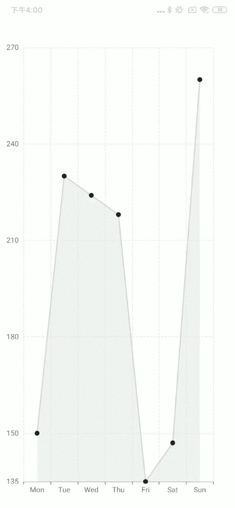

# アダプティブサイズのチャートを作成する

コーディングのプロセス中に、固定サイズのチャートを直接定義するのではなく、EChartsのチャートをコンテナのサイズに自動的に適応させたい場合があります。ここでは、これを実現するためのシンプルな例を提供します。

1. まず、前の例と同様に、チャートの依存関係をインポートします。ここではLineChartを使用しているため、それだけをインポートします。実際の使用ケースに応じて、特定のチャートをインポートする必要があります。

```tsx
import React, { useState, useRef, useEffect } from "react";
import { StyleSheet, View, Dimensions } from "react-native";
import * as echarts from "echarts/core";
import { LineChart } from "echarts/charts";
import { GridComponent } from "echarts/components";
import { SkiaRenderer, SkiaChart } from "@wuba/react-native-echarts";
```

2. echarts.useを使用してレンダラとチャートを登録します。

```tsx
echarts.use([SkiaRenderer, LineChart, GridComponent]);
```

3. SkiaChartコンポーネントのためのRefを作成し、Viewコンテナでそれをラップします。後でEChartsのチャートに割り当てるために、onLayoutを使用してコンテナの幅と高さを取得します。

```tsx
export default function App() {
  const skiaRef = useRef<any>(null);
  const chartRef = useRef<any>(null);
  const [chartWidth, setChartWidth] = useState<number>(0);
  const [chartHeight, setChartHeight] = useState<number>(0);
}
```

4. チャートのオプションを記述します。

```tsx
const option = {
  xAxis: {
    type: "category",
    data: ["Mon", "Tue", "Wed", "Thu", "Fri", "Sat", "Sun"],
    splitLine: {
      show: true,
      lineStyle: {
        type: "dashed",
      },
    },
  },
  yAxis: {
    type: "value",
    min: "dataMin",
    splitLine: {
      show: true,
      lineStyle: {
        type: "dashed",
      },
    },
  },
  series: [
    {
      data: [150, 230, 224, 218, 135, 147, 260],
      type: "line",
      areaStyle: {
        color: "rgba(230, 231, 231,0.8)",
      },
      lineStyle: {
        color: "#d6d6d7",
      },
      symbol: "circle",
      symbolSize: 8,
      itemStyle: {
        color: "#24262a",
      },
    },
  ],
};
```

5. チャートのインスタンスを作成し、オプションを設定します。

```tsx
let chart = echarts.init(skiaRef.current, "light", {
  renderer: "skia",
  width: chartWidth,
  height: chartHeight,
});
chart.setOption(option);
```

上記の手順に従うと、親コンテナのサイズに合わせた初期のチャートが表示されます。チャートのサイズを外部の条件に応じて自動的に適応させる必要がある場合は、さらにいくつかの手順が必要です。ここでは、モバイル画面のサイズの変更に応じてチャートをレスポンシブにする方法を示します。

6. 'Dimensions'の変更イベントを登録して、画面サイズの変更を監視します。

```tsx
const handleDimensionsChange = (e) => {
  const { width, height } = e.screen;
};

useEffect(() => {
  Dimensions.addEventListener("change", handleDimensionsChange);
  return () => {
    Dimensions.removeEventListener("change", handleDimensionsChange);
  };
}, []);
```

7. 画面サイズの変更を検出したら、チャートのサイズをリセットします。

```tsx
const handleDimensionsChange = (e) => {
  const { width, height } = e.screen;
  setChartWidth(width);
  setChartHeight(height);
};
```

8. チャートを再描画します。

```tsx
useEffect(() => {
  chartRef.current.resize({
    width: chartWidth,
    height: chartHeight,
  });
}, [chartWidth, chartHeight]);
```

完全なコードは以下の通りです:

```tsx
import React, { useState, useRef, useEffect } from "react";
import { StyleSheet, View, Dimensions } from "react-native";
import * as echarts from "echarts/core";
import { LineChart } from "echarts/charts";
import { GridComponent } from "echarts/components";
import { SkiaRenderer, SkiaChart } from "@wuba/react-native-echarts";

echarts.use([SkiaRenderer, LineChart, GridComponent]);

export default function App() {
  const skiaRef = useRef<any>(null);
  const chartRef = useRef<any>(null);
  const [chartWidth, setChartWidth] = useState<number>(0);
  const [chartHeight, setChartHeight] = useState<number>(0);

  useEffect(() => {
    Dimensions.addEventListener("change", handleDimensionsChange);
    return () => {
      Dimensions.removeEventListener("change", handleDimensionsChange);
    };
  }, []);

  useEffect(() => {
    const option = {
      xAxis: {
        type: "category",
        data: ["Mon", "Tue", "Wed", "Thu", "Fri", "Sat", "Sun"],
        splitLine: {
          show: true,
          lineStyle: {
            type: "dashed",
          },
        },
      },
      yAxis: {
        type: "value",
        min: "dataMin",
        splitLine: {
          show: true,
          lineStyle: {
            type: "dashed",
          },
        },
      },
      series: [
        {
          data: [150, 230, 224, 218, 135, 147, 260],
          type: "line",
          areaStyle: {
            color: "rgba(230, 231, 231,0.8)",
          },
          lineStyle: {
            color: "#d6d6d7",
          },
          symbol: "circle",
          symbolSize: 8,
          itemStyle: {
            color: "#24262a",
          },
        },
      ],
    };
    let chart: any;
    if (skiaRef.current) {
      chart = echarts.init(skiaRef.current, "light", {
        renderer: "skia",
        width: chartWidth,
        height: chartHeight,
      });
      chart.setOption(option);
      chartRef.current = chart;
    }
    return () => chart?.dispose();
  }, []);


  // サイズの変更を監視し、チャートを再描画する。
  useEffect(() => {
    chartRef.current.resize({
      width: chartWidth,
      height: chartHeight,
    });
  }, [chartWidth, chartHeight]);

  // コンテナの幅と高さを取得する
  const handleLayout = (e) => {
    const { width, height } = e.nativeEvent.layout;
    setChartWidth(width);
    setChartHeight(height);
  };

  // 画面の向きが変わったときのイベント
  const handleDimensionsChange = (e) => {
    const { width, height } = e.screen;
    setChartWidth(width);
    setChartHeight(height);
  };

  // 親コンテナボックスは幅と高さを持っている必要があるため、継承するために
  return (
    <View style={styles.container} onLayout={handleLayout}>
      <SkiaChart ref={skiaRef} />
    </View>
  );
}

const styles = StyleSheet.create({
    container: {
        flex: 1,
        alignItems: 'center',
        justifyContent: 'center',
    },
}
```

以下の画面が表示されるはずです:

| iOS                      | Android                          |
| ------------------------ | -------------------------------- |
|  |  |

react-native-svgを使用したい場合は、SkiaChartをSvgChartに置き換えてください、そして、レンダラーとして「svg」を使用します。

より詳細なチャートの設定については、[echartsのドキュメント](https://echarts.apache.org/en/option.html#title)を参照してください。

