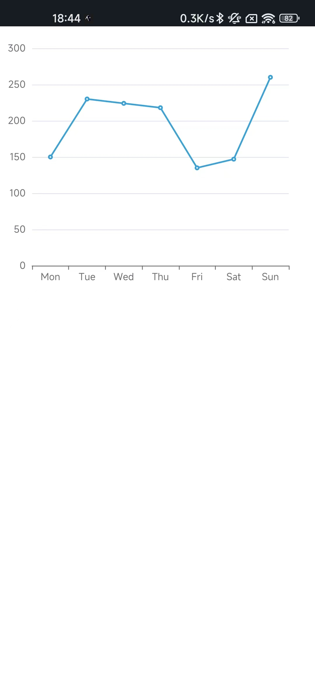

# シンプルな折れ線グラフを作成する

次に、最も基本的な図形である「基本的な折れ線グラフ」を描いてみましょう。

ブラウザでの表示を確認するには、[echartsエディター](https://echarts.apache.org/examples/en/editor.html?c=line-simple)にアクセスし、設定を変更して変化を確認してみてください。

1. echarts、@wuba/react-native-echarts、reactをインポートします。ここでは、SkiaChartとSVGRendererのみをインポートしています。

```tsx
import React, { useRef, useEffect } from 'react';
import * as echarts from 'echarts/core';
import { LineChart } from 'echarts/charts';
import { GridComponent } from 'echarts/components';
import { SVGRenderer, SkiaChart } from '@wuba/react-native-echarts';
```

2. echarts.useを使用して、レンダラーとチャートを登録します。

```tsx
echarts.use([SVGRenderer, LineChart, GridComponent]);
```

3. SkiaChartのためのrefを作成します。

```tsx
export default function App() {
  const skiaRef = useRef<any>(null);
  return <SkiaChart ref={skiaRef} />;
}
```

4. グラフのオプションを記述します。

```tsx
const option = {
  xAxis: {
    type: 'category',
    data: ['月', '火', '水', '木', '金', '土', '日'],
  },
  yAxis: {
    type: 'value',
  },
  series: [
    {
      data: [150, 230, 224, 218, 135, 147, 260],
      type: 'line',
    },
  ],
};
```

5. チャートのインスタンスを作成し、オプションを設定します。

```tsx
let chart = echarts.init(skiaRef.current, 'light', {
  renderer: 'svg',
  width: 400,
  height: 400,
});
chart.setOption(option);
```

6. useEffectを使用して、チャートが初期化されるのは1回だけであることを確認します。また、コンポーネントがアンマウントされたときにチャートを破棄します。

```tsx
useEffect(() => {
  return () => chart?.dispose();
}, []);
```

以上です！以下にコードを示します：

```tsx
import React, { useRef, useEffect } from 'react';
import * as echarts from 'echarts/core';
import { LineChart } from 'echarts/charts';
import { GridComponent } from 'echarts/components';
import { SVGRenderer, SkiaChart } from '@wuba/react-native-echarts';

echarts.use([SVGRenderer, LineChart, GridComponent]);

export default function App() {
  const skiaRef = useRef<any>(null);
  useEffect(() => {
    const option = {
      xAxis: {
        type: 'category',
        data: ['月', '火', '水', '木', '金', '土', '日'],
      },
      yAxis: {
        type: 'value',
      },
      series: [
        {
          data: [150, 230, 224, 218, 135, 147, 260],
          type: 'line',
        },
      ],
    };
    let chart: any;
    if (skiaRef.current) {
      chart = echarts.init(skiaRef.current, 'light', {
        renderer: 'svg',
        width: 400,
        height: 400,
      });
      chart.setOption(option);
    }
    return () => chart?.dispose();
  }, []);

  return <SkiaChart ref={skiaRef} />;
}
```

以下の画面が表示されるはずです：

| iOS | Android |
| --- | --- |
|  |  |

react-native-svgを使用する場合は、SkiaChartをSvgChartに置き換えてください。

次に、@wuba/react-native-echartsで使用できるさまざまな設定を[echartsの例](https://echarts.apache.org/examples/en/index.html)から見つけることができます。