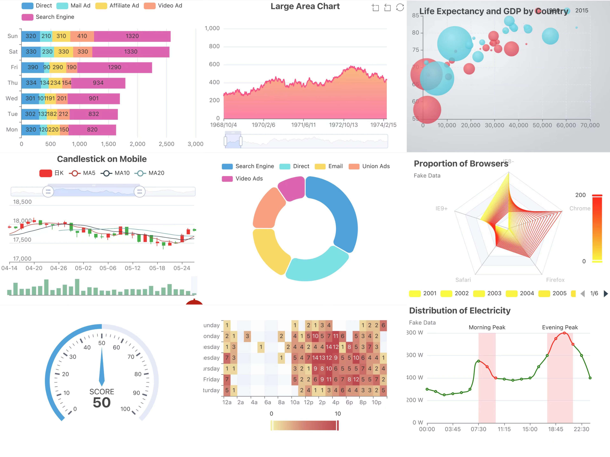
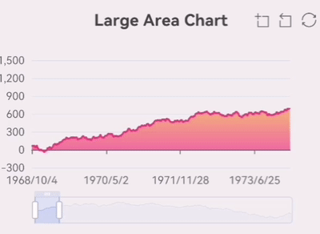

我們為 React Native APP 開發了一個[開源圖形庫](https://github.com/wuba/react-native-echarts)，它基於 [Apache ECharts](https://github.com/apache/echarts) 並使用 [RNSVG](https://github.com/react-native-svg/react-native-svg) 或 [RNSkia](https://github.com/shopify/react-native-skia) 進行渲染，幾乎與在 Web 上使用相同，可以滿足大多數的圖形情況。該項目的原始碼可在 https://github.com/wuba/react-native-echarts 找到。


<!--truncate-->
## 介紹

在繪製圖表時，我們最常使用的圖表庫是 ECharts。作為市場上最成熟的圖表庫之一，主要用於 Web 端使用，在 React Native 中沒有最佳的使用方式。面對這種情況，我們的解決方案如下：

選項 1：作為替代方案，使用專門針對 React Native 開發的圖表庫，例如 [react-native-charts-wrapper](https://github.com/wuxudong/react-native-charts-wrapper)、[victory-native](https://github.com/FormidableLabs/victory/tree/main/packages/victory-native)等。這些圖表庫的風格和互動與 ECharts 不同，且圖表豐富度不夠。特別是在多平台需求場景中需要為 React Native 製定單獨的 UI 互動設計。

選項 2：通過 [react-native-webview](https://github.com/react-native-webview/react-native-webview) 渲染圖表。此解決方案使用 injectedJavaScript 進行初始化和 postMessage 進行事件響應，您可以直接使用開源庫庫如 [react-native-echarts-pro](https://github.com/supervons/react-native-echarts-pro)、[native-echarts](https://github.com/somonus/react-native-echarts) 等。當頁面上存在多個或者太多元素時會遇到性能 bottleneck 問題，例如 Android 上大數據量區域圖和單軸散點圖出現白屏現象，在渲染期間也會明顯出現延遲和幀率下降。

因此，我們考慮開發一個新的圖表庫，在其中整合 ECharts 的功能以提高 React Native 應用程式的可用性和性能。

由於我們不想從頭開始撰寫一個視覺化函式庫，讓我們看看目前已經針對 React Native 設計好了哪些視覺化函式庫：

1. react-native-svg：提供 iOS、Android、macOS、Windows 的 SVG 支援以及 Web 的相容層支援。
2. react-native-skia：React Native Skia 將 Skia 圖形函式庫引入到 React Native 中。Skia 是 Google Chrome 和 和 Chrome OS、Android、Flutter、Mozilla Firefox 和 Firefox OS 等眾多產品所採用的图形引擎，并提供支持 SVG 格式影像渲染功能之 [ImageSVG](https://shopify.github.io/react-native-skia/docs/images-svg) 元件。

我知道 ECharts 支持 SVG 渲染, 因此如果我们在渲染图标之前获取 SVG 数据并将其提供给 react-native-svg 或 react-native-skia 进行渲染，则可以实现我们目标.

经过一段时间试验后, 我们开发了 [@wuba/react-native-echart](https://github.com/wuba/react-native-echarts)，具有以下功能：

- 🔥 与 Apache ECharts 相同
- 🎨 豐富图示涵蓋幾乎所有使用情境
- ✨ 可选渲染名库, Skia 或 SVG
- 🚀 能夠與 web 共享代码
- 📱 支持缩放手势

## 如何使用

在实践中，@wuba/react-native-echarts 的整体流程与 ECharts 类似：

1. yarn add @wuba/react-native-echarts
2. 选择安装 react-native-svg 或 @shopify/react-native-skia
3. 从 @wuba/react-native-echarts 引入相关组件
4. 将 ECharts 的 SVGRenderer 替换为 @wuba/react-native-echarts 的 SVGRenderer
5. 编写图表的选项配置信息
6. 使用 SkiaChart / SvgChart 组件

以下是示例代码：

```ts
// import { SkiaChart, SVGRenderer } from '@wuba/react-native-echarts';
import SkiaChart, { SVGRenderer } from '@wuba/react-native-echarts/skiaChart';
import * as echarts from 'echarts/core';
import { useRef, useEffect } from 'react';
import { LineChart } from 'echarts/charts';

echarts.use([ SVGRenderer, LineChart ])

export default function App() {
  const skiaRef = useRef<any>(null);
  useEffect(() => {
    const option = {
      xAxis: {
        type: 'category',
        data: ['Mon', 'Tue', 'Wed', 'Thu', 'Fri', 'Sat', 'Sun']
      },
      yAxis: {
        type: 'value'
      },
      series: [
        {
          data: [150, 230, 224, 218, 135, 147, 260],
          type: 'line'
        }
      ]
    }
    let chart: any;
    if (skiaRef.current) {
      chart = echarts.init(skiaRef.current, 'light', {
        renderer: 'svg',
        width: 250,
        height: 300,
      });
      chart.setOption(option);
    }
    return () => chart?.dispose();
  }, []);

  return <SkiaChart ref={skiaRef} />;
}
```

這是它的螢幕截圖：


不是特別容易嗎？更多的圖表配置可以在 [echarts 網站](https://echarts.apache.org/examples/en/index.html)上查看。

我們支援目前由 ECharts 支援的大部分圖表。我將展示一些下面的圖表，更多範例可以在[taro-playground](https://github.com/wuba/taro-playground)項目中看到。





## 表現

如前所述，在 React Native 中使用 ECharts 的主流解決方案是透過 WebView 實現它。 在許多基於 WebView 的實現中，react-native-echarts-pro 有更多的使用者，因此我們選擇了 react-native-echarts-pro 作為比較。

以下是不同實現的初始化過程的螢幕截圖：


經過不少測試用例，我們發現 @wuba/react-native-echarts 在常規使用場景中具有效能優勢，但在資料量大的場景中，由於宣告性 UI 渲染方法，將出現明顯的滯後，我們將繼續探索以提高效能。

## 實施細節


上面是該函式庫的流程圖，以 react-native-svg 為例，核心工作流程為：

1. 取代 ECharts 的 SVGRenderer，將已註冊的 SVGPainter 替換為自訂的 SVGPainter。
2. CustomSVGPainter 繼承自 SVGPainter，重寫了建構子和部分刷新函數，在圖表資料初始化或更新時呼叫 SVGComponent 上註冊的 patch 函數，並將計算出的新 SVG 資料傳遞給它。
3. 定義 SVGComponent，它管理目前圖表實例，其上有一個核心補丁函數，用於接收即時 SVG 數據，然後呼叫 SVGElement 函數。
4. SVGElement 函數迭代所有 SVG 節點並將其轉換為 react-native-svg 提供的對應 SVG 元素以進行最終的渲染操作。

使用 react-native-skia 時，存在一些差異。定義的 SkiaComponent 元件上有一個核心方法 patchString。 patchString 接收變化的 SVG 數據，將其轉換為 SVG 字串，並傳遞給 react-native-skia 的 ImageSVG 元件進行渲染。

## 處理觸控事件

ECharts事件是滑鼠事件，如 click、dblclick、mousedown、mousemove 等。 滑鼠事件用於觸發圖表元素的顯示或動畫。

我們使用 React Native 的 PanResponder 來捕獲事件，然後將移動 TouchEvent 模擬為滑鼠事件，並將其傳送到 ECharts init 方法生成的圖表例項。

例如，跟隨滑鼠在圖表上顯示圖例的動作是移動端的 TouchStart + TouchMove，這轉化為滑鼠向下+滑鼠移動的滑鼠事件。

另一個例子是圖表的縮放，移動端是雙指縮放，轉換為滑鼠滑鼠輪事件，相應的滑鼠輪滾動距離由兩指距離變化計算。

以下是關鍵程式：

1. 將 TouchEvent 轉換為 MouseEvent

```ts
PanResponder.create({
  onPanResponderGrant: ({ nativeEvent }) => {
    // Action start, translated into mouse down and move events
    dispatchEvent(
      zrenderId,
      ['mousedown', 'mousemove'],
      nativeEvent,
      'start'
    );
  },
  onPanResponderMove: ({ nativeEvent }) => {
    // Handling finger movement operations
    const length = nativeEvent.touches.length;
    if (length === 1) {
      // single finger
    } else if (length === 2) {
      // Handling two-finger movement operations here
      if (!zooming) {
        // ...
      } else {
        // Here the event is converted to a scroll wheel
        const { initialX, initialY, prevDistance } = pan.current;
        const delta = distance - prevDistance;
        pan.current.prevDistance = distance;
        dispatchEvent(zrenderId, ['mousewheel'], nativeEvent, undefined, {
          zrX: initialX,
          zrY: initialY,
          zrDelta: delta / 120,
        });
      }
    }
  },
  onPanResponderRelease: ({ nativeEvent }) => {
    // The action is over, where it is transformed into a mouse click release operation
  },
})
```

2. 將 MouseEvent 應用於 ECharts 圖表例項

```ts
function dispatchEvent(
  zrenderId: number,
  types: HandlerName[],
  nativeEvent: NativeTouchEvent,
  stage: 'start' | 'end' | 'change' | undefined,
  props: any = {
    zrX: nativeEvent.locationX,
    zrY: nativeEvent.locationY,
  }
) {
  if (zrenderId) {
    var handler = getInstance(zrenderId).handler;
    types.forEach(function (type) {
      handler.dispatch(type, {
        preventDefault: noop,
        stopImmediatePropagation: noop,
        stopPropagation: noop,
        ...props,
      });
      stage && handler.processGesture(wrapTouch(nativeEvent), stage);
    });
  }
}
```

## 有關更多資訊

前往 https://github.com/wuba/react-native-echarts 查看源代碼，如果你喜歡的話給我們一顆星。如果遇到任何問題，可以提交[問題](https://github.com/wuba/react-native-echarts/issues)。

本帖中的示例代碼位於 https://github.com/wuba/taro-playground 項目中，該項目也是開源的，有興趣的人也可以直接從應用商店或[發布頁面](https://github.com/wuba/taro-playground/releases)安裝 Taro Playground 應用程式的新版本來體驗它。