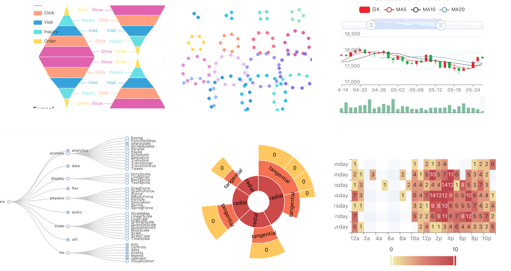
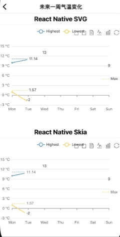
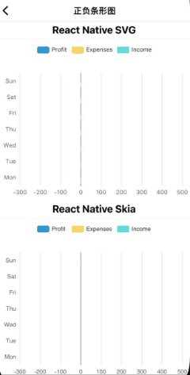
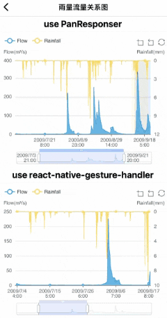

我們很高興地宣布 React Native ECharts 1.1 正式發布。在這個新版本中，我們新增了對 [react-native-gesture-handler](https://github.com/software-mansion/react-native-gesture-handler) 手勢解決方案的支援，以及其他增強功能。繼續閱讀以了解更多詳情！

[@wuba/react-native-echarts](https://github.com/wuba/react-native-echarts/) 是一個基於 Apache ECharts、並利用 [react-native-svg](https://github.com/software-mansion/react-native-svg) 和 [react-native-skia](https://github.com/shopify/react-native-skia) 的 React Native 圖表庫。相較於基於 WebView 的解決方案，它具有顯著的性能優勢。如果您想了解更多有關該項目的設計原則，可以[點擊這裡](https://wuba.github.io/react-native-echarts/blog/using-wuba-react-native-echarts)。

為了提供更直觀和準確的項目功能理解，我們決定正式將初始版本 `wrn-echarts` 更名為 `@wuba/react-native-echarts`。在這個新版本中。

項目源代碼可在 https://github.com/wuba/react-native-echarts 找到。

## 功能

### 支援豐富的圖表類型

[@wuba/react-native-echart](https://github.com/wuba/react-native-echarts) 是一個將 [ECharts](https://echarts.apache.org/en/index.html) 圖表庫引入 React Native 應用程序的解決方案。它利用 React Native 的原生組件的渲染能力，大大提高了渲染速度。它支援多種常用的圖表類型，包括折線圖、面積圖、柱狀圖和散點圖，還支援複雜的圖表類型，如蠟燭圖和熱力圖。它可以滿足不同場景下的各種可視化需求。

以下是一些常見圖表類型的示例：

除了常見的圖表類型外，`@wuba/react-native-echart` 還支援多種其他圖表，如樹狀圖、熱力圖和 K 線圖，並具有出色的渲染性能。

此外，我們還提供全面的支援各種動態圖表，以下是一些示例。圖表 1 和圖表 2 展示了多個國家人均收入的動態變化。圖表 1 展示了過去 70 年人均收入的增長趨勢，而圖表 2 展示了 1982 年 10 個國家人均收入的動態排序。圖表 3 顯示了一個隨時間變化並根據不斷變化的數值自適應的速度計，而圖表 4 則展示了一個動態節點添加圖表。這些圖表可以根據不斷變化的數據動態重新渲染。無論數據更新頻率如何，它們始終提供出色的渲染性能。

`@wuba/react-native-echart` 支援多種圖表類型，但這裡無法一一展示。如果您想探索更多全面的圖表類型，可以訪問 [taro-playground](https://github.com/wuba/taro-playground) 存儲庫查看。在那裡，您將找到展示各種 ECharts 圖表類型的示例演示。

### 支援 Svg 和 Skia

`@wuba/react-native-echart` 支援兩種渲染模式：Svg 和 Skia。它基於 `react-native-svg` 和 `react-native-skia` 實現。如何在兩種渲染模式之間進行選擇？從渲染速度的角度來看，Svg 和 Skia 的性能相似，如下圖所示。然而，需要注意的是，Skia 渲染在支援中文語言方面存在一些限制。為了正確顯示中文字符，您需要單獨設置字體。因此，在選擇渲染庫時，請考慮項目的語言要求和對中文語言支援的重要性。我們建議根據具體情況選擇適當的渲染模式，以實現最佳性能和用戶體驗。

### 支援各種手勢

支援點擊、拖動和縮放等各種手勢。默認情況下，我們使用 React Native 內置的 PanResponder 來處理這些手勢。從版本 1.1 開始，我們新增了對 `react-native-gesture-handler` 库的支援。如果您已經將這個手勢庫集成到項目中，我們建議直接使用它來處理手勢，以提升性能和用戶體驗。

以下是兩種手勢解決方案的比較。從圖表滾動的流暢度來看，默認手勢處理和使用 `react-native-gesture-handler` 都提供了出色的流暢度。您可以根據自己的需求選擇適合的方法。

### Web 支援

我們還支援在 Web 環境中重用 `@wuba/react-native-echart` 的組件，以滿足跨平台需求並實現代碼共享。這樣可以實現代碼統一，確保不同平台上的圖表一致性，提高開發效率。

[ECharts 圖表庫](https://echarts.apache.org/examples/en/index.html#chart-type-line)提供了許多網絡渲染示例。但它在 React Native 上的表現如何？為了解決這個問題，我們提供了相應的在線預覽和測試支援。您可以直接複製圖表配置，查看它在 React Native 上的渲染效果。[在線預覽點擊這裡](https://wuba.github.io/react-native-echarts/docs/expo-snacks/simple-line-chart)

## 路線圖

儘管我們已經對 ECharts 進行了廣泛和全面的支援，但我們致力於進一步優化和增強它。在我們即將開展的工作中，我們將重點關注以下領域的改進和增強，以提供更精緻的功能。[點擊這裡](https://github.com/orgs/wuba/projects/10)查看更詳細的信息和進度更新。

### 性能優化

相較於使用 Webview 的渲染解決方案，`@wuba/react-native-echart` 在整體渲染性能方面已經取得了顯著的改進。然而，在處理大數據集時，渲染速度和內存使用方面仍有進一步的優化空間。我們致力於優化處理大數據集的性能，以確保在各種複雜數據場景下實現卓越的性能和穩定性。

### 已知問題修復

目前，對 ECharts 圖表庫的支援已經非常全面。然而，在某些圖表渲染方面仍存在一些需要改進的問題，例如不支援地圖顯示和 Skia 渲染模式下圖片顯示不正確。我們非常重視這些問題，將繼續努力修復它們，以提供更好的圖表呈現體驗。

### 支援 ECharts GL

隨著 3D 可視化在各種業務場景中的廣泛應用，例如下面展示的 3D 圖表，我們將繼續探索和增強對 ECharts GL 的支援，以滿足更多的業務需求。您可以點擊[這裡](https://github.com/orgs/wuba/projects/10)查看最新進展。

### 改進基礎設施

未來，我們將繼續改進基礎設施，完善測試用例、添加用戶用例和其他內容。標準化的測試用例可以檢查開發過程中的任何更改是否對其他功能產生影響。我們將逐步添加更多的測試用例，標準化代碼並提高代碼質量。

## 致謝

我們衷心感謝 `@wuba/react-native-echarts` 開源社區中的所有朋友。無論您是否對代碼庫做出了貢獻，提供了帶有上下文信息的錯誤報告，還是分享了增強現有功能的想法，您的貢獻對這個項目來說都是非常寶貴的。我們衷心歡迎您加入我們，積極參與項目的討論和協作開發。

最後，我們要特別感謝為項目的成功做出貢獻的開發人員：

